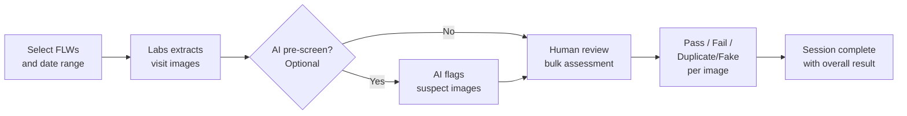

# Audit & QA Review

The Audit module lets program managers and supervisors review field worker (FLW) visit images for quality assurance. You can sample visits from CommCare, assess images against program standards, and optionally use AI to pre-screen before human review.

---

## How It Works

---

## Creating an Audit Session

Navigate to **Audit** in the top menu, then click **Create Audit Session**.

**Step 1 — Choose your scope:**

- Select the **opportunity** from the search table — the table shows the opportunity name, its **Program**, and other details so you can confirm you are selecting the right one
- Set a **date range** for visits to review
- Set how many visits to sample — either a fixed number or a percentage of total visits

**Step 2 — Preview and confirm:**

- Labs shows how many visits match your criteria before you commit, including a list of matched field workers shown by their **real display names** (not internal ID codes)
- Adjust filters if needed, then click **Create**

**Step 3 — Sampling and filters:**

After setting your date range and sample size, two additional filter sections appear below the sampling configuration:

- **Deliver Unit Type** — a checkbox list of the form names used to submit visits. Tick one or more to include only visits submitted with those forms. Leave all unticked to include all forms.
- **Visit Type** — a checkbox list of visit statuses (for example, Pending, Approved, Rejected, Over Limit). Tick one or more to include only visits with those statuses. Leave all unticked to include all statuses.

Both filters are applied when you click **Update Preview**, so you can see exactly how many visits match before you proceed.

**Step 5 — Audit Field Configuration:**

This step appears once you have selected your opportunities. It has two sections:

- **Select the image types to audit** — an auto-detected picker lists the image question types available for the selected opportunity. Each image type is shown by its full question path (for example, `household_visit/child_screening/muac_photo`) so you can confirm exactly which form field you are including. Select one or more types to include in this session.
- **AI reviewer per image type** — when you tick an image type, an AI reviewer dropdown appears directly beneath it. You can select a different reviewer for each image type, or leave the dropdown blank to skip AI review for that type. Each reviewer only appears for the image types it is designed for. This replaces the previous single-reviewer dropdown — each photo type now runs only the reviewer you choose for it.
- **Reviewer settings** — some reviewers require one extra setting, which appears immediately under the reviewer dropdown when that reviewer is selected:
    - **Scale Image Validation** asks you to choose a **Manual Scale Value** field — a dropdown of your opportunity's form fields that tells the reviewer which recorded weight to compare against the scale photo.
    - **MUAC OverZoom** requires no extra settings.
    If a reviewer needs a setting and you leave it blank, the wizard will stop you before creating the session.
- **Context fields** (collapsed by default) — optionally associate any supporting form fields (such as a recorded measurement value) with an image type so that human reviewers can see the relevant data alongside each photo. These associations have no effect on AI review.

**Pass Threshold:**

Also on the metadata step of the wizard, you can set a **Pass Threshold** using a slider. The slider ranges from **75% to 100%** and defaults to **100%**.

The threshold controls how the overall audit result is calculated when a reviewer completes the session:

- If the percentage of assessments that passed meets or exceeds the threshold, the audit is marked **Pass**.
- If it falls below the threshold, the audit is marked **Fail**.

The pass percentage is calculated by dividing the number of images marked Pass by the FLW's **total image count** for the session — not just the images assessed so far. This means the percentage shown in the FLW Summary table accurately reflects progress against the full sample at all times.

At the default of 100%, any single failed assessment will fail the entire audit — the same behaviour as before this option was introduced. Lowering the threshold allows a small number of failures without failing the whole audit.

The configured threshold is shown as small italic text — *Pass Threshold : x%* — underneath the FLW Summary table on the review page, so reviewers can see the standard that applies to the session they are working in.

!!! tip "Quick-create links"
    If you regularly audit the same image types, you can pre-select them by adding `?image_paths=<full/path1>,<full/path2>` to the audit-creation URL. The picker will open with those types already selected, saving setup time.

**Choosing AI assistance (within Step 5):**

Once you select an image type, an **AI Review Agent** dropdown appears beneath it. Select an agent for that image type if you want AI assistance, or leave it blank to skip AI review for that type. Because each image type has its own dropdown, you can — for example — run **MUAC OverZoom** on MUAC photos and **Scale Image Validation** on weight photos in the same session, with no risk of the wrong reviewer running on the wrong photo type.

When an agent is selected, you will also see per-verdict **"Auto-tag results before I review"** checkboxes — one for each possible verdict the agent can produce. These work the same way as in the review queue:

- **Ticked** — the AI pre-tags matching images with that result before you open the review queue.
- **Unticked** — the AI still badges every image with its classification, but leaves the Pass/Fail decision to you.

The default is **flag-only** (all checkboxes unticked), so nothing is pre-tagged unless you opt in.

!!! tip "Not sure whether to pre-tag?"
    Start with the default flag-only setting. Review a session to see how well the AI's classifications match your program standards, then enable pre-tagging for the verdicts you consistently agree with.

!!! tip "Large audits"
    Creating a session with many visits runs in the background. You'll see a progress indicator — come back in a few minutes for large samples.

---

## Reviewing Images

Once a session is created, open it to start the bulk assessment.

The bulk assessment page header identifies the field worker being reviewed as **FLW Name : `<name>`**, using the FLW's real display name so you can always confirm whose images you are looking at.

=== "Standard Review"

    Images are shown one at a time alongside the related visit data — FLW name, visit date, and patient name.

    Each image has three assessment options:

    - **Pass** and **Fail** appear side by side as before.
    - **Duplicate/Fake** appears as a full-width button below Pass and Fail (shown in orange with an exclamation icon). Use this when an image appears to be a duplicate submission or a fabricated photo rather than a genuine field visit. The image card border, corner badge, and lightbox all use the same orange treatment when this option is selected.

    Add optional notes to any image, then move to the next. Your progress saves automatically.

=== "AI-Assisted Review"

    Before you start, click **Run AI Review** to have AI pre-screen all images in the session. AI review processes multiple images at the same time, so a session of around 30 images typically completes in about 2 minutes.

    The AI reviewer assigned to each image type during session creation runs only on images of that type. If you assigned different reviewers to different photo types, each photo is assessed only by the reviewer you chose for it.

    | Agent | When it appears | What it does |
    | --- | --- | --- |
    | **Scale Image Validation** | A weight-related image type is selected and this agent is chosen for it | Compares scale photos against the reading entered by the FLW and flags mismatches |
    | **MUAC OverZoom** | A MUAC image type is selected and this agent is chosen for it | Classifies photos for excessive zoom and flags images the agent identifies as hyperzoomed |

    If no agent is selected for an image type, that type's photos are not pre-screened by AI — the workflow behaves exactly as standard review for those images.

    AI results appear alongside each image as suggestions — you make the final Pass/Fail/Duplicate/Fake call. Images flagged by the AI are highlighted so you can prioritize reviewing them first.

    ### Choosing how the AI applies its verdicts

    Next to each AI Review Agent dropdown (in Step 5 of the wizard), each possible AI verdict has a checkbox — for example, "Automatically pre-tag photos flagged as hyperzoomed as Fail" or "Automatically pre-tag readings that match the scale as Pass". You can tick any combination of these:

    - **Ticked** — the AI pre-tags matching images with that result before you open the review queue.
    - **Unticked** — the AI still badges every image with its classification, but leaves the Pass/Fail decision to you.

    The default is **flag-only** (all checkboxes untinted), so nothing is pre-tagged unless you opt in. This means the AI's assessments are always visible, but automated pre-tagging only happens when you have explicitly chosen it.

    Regardless of your checkbox settings, you can always bulk-apply any verdict with one click — for example, **Fail all Hyperzoomed (N)** — directly from the review queue.

    !!! tip "Not sure whether to pre-tag?"
    Start with the default flag-only setting. Review a session to see how well the AI's classifications match your program standards, then enable pre-tagging for the verdicts you consistently agree with.

    **AI classification labels** appear at the bottom of each image tile (below the **Add Note** field) once the AI has reviewed the photo. The label shows the agent name and its classification for that image:

    | Agent | Possible label |
    | --- | --- |
    | **MUAC OverZoom** | "MUAC OverZoom: Hyperzoomed" or "MUAC OverZoom: Not Hyperzoomed" |
    | **Scale Image Validation** | "Scale Validation: Passed" or "Scale Validation: Failed" |

    If the AI encountered a problem reviewing a specific image, the label turns red and shows the error message. Images that have not yet been reviewed by the AI show no label.

    These labels let you see at a glance what the AI classified every image as — not just the ones that were flagged — without relying solely on any pre-tag badge.

    !!! tip "MUAC OverZoom pre-tagging"
    When the MUAC OverZoom agent is used and the pre-tag checkbox for hyperzoomed images is ticked, images it identifies as hyperzoomed arrive in your review queue already marked **Fail** with a red **Hyperzoomed** badge. If the checkbox is unticked, those images are still badged with the AI classification label but appear as normal pending photos for your human review. In both cases, you can confirm each result or override it if you disagree.

### Bulk actions

At the top of the bulk assessment page, several bulk action buttons let you apply results to multiple images at once:

| Button | What it does |
| --- | --- |
| **Pass All Pending** | Marks every image that has not yet been assessed as Pass |
| **Fail All Pending** | Marks every image that has not yet been assessed as Fail |
| **Mark All Duplicate/Fake** | Marks **every currently-visible image** as Duplicate/Fake, including images that already have a Pass or Fail result |
| **Clear All Assessments** | Removes all results from every image in the current view |

!!! warning "Mark All Duplicate/Fake overrides existing results"
    Unlike the Pass/Fail pending buttons, **Mark All Duplicate/Fake** replaces any existing assessment on an image. Use it when you have determined that an entire batch of images from a session is invalid.

**Keyboard shortcuts** (work in both review modes):

| Key | Action         |
| --- | -------------- |
| `P` | Mark Pass      |
| `F` | Mark Fail      |
| `→` | Next image     |
| `←` | Previous image |

### FLW Summary table

The FLW Summary table on the review page shows a row for each field worker in the session. The columns include:

- **% Passed** — the number of images marked Pass divided by the FLW's **total image count** for the session. This gives an accurate picture of overall performance even before all images have been reviewed.
- **Duplicate/Fake** — the count of images marked Duplicate/Fake for that FLW. This column was previously labelled "Incomplete."

The Pass Threshold in effect is shown as small italic text — *Pass Threshold : x%* — beneath the table.

### Exporting the Image List

On the Bulk Assessment page, click **Export CSV** to download a spreadsheet of every image in the session. The file includes:

| Column | What it contains |
| --- | --- |
| **Filename** | The name of the image file |
| **Visit date** | The date the visit took place |
| **Visit number** | The visit identifier |
| **Form link** | A direct link to view the full form submission in CommCareHQ |

This is useful when you want to share the image list with colleagues, track review progress in a spreadsheet, or look up the original form submission without searching CommCareHQ manually.

### If an image does not load

The review screen loads images in a controlled stream — a handful at a time — rather than all at once. This prevents request overloads on large sessions and means most photos appear reliably without any action on your part.

If a photo still has trouble loading, the screen retries it automatically a few times. If it cannot load after those retries, the tile shows a clear **"Image failed to load"** message with a **Retry** button. Click **Retry** to attempt loading that photo again — a single click is usually enough to recover from a temporary connection hiccup.

Once a photo has loaded, your browser keeps it cached, so scrolling through the grid or resizing your window will not cause it to reload.

!!! tip "Persistent failures"
    If a photo continues to fail after retrying, check your internet connection and try refreshing the page. If the problem affects many images, contact your program administrator.

---

## Tracking Audit Creation Progress

When you create an audit session that includes an AI reviewer, the work happens in the background. The progress indicator now reflects what is actually happening in real time:

- **The progress bar fills gradually** as the AI works through images. It only turns green and shows as complete when every image has been reviewed — it no longer jumps to full as soon as the AI step begins.
- **The audit list shows a live image count** — for example, "Reviewed 45/136 images (12 passed, 3 failed)" — that updates every couple of seconds while reviewing is in progress.
- **The counter next to the bar** shows the image count during the AI-review step (for example, "45/136") rather than a stage number.

This means you can check the audit list at any point and see exactly how far along the AI review is before you open the session.

!!! tip "Large audits"
    For sessions with many images, the live count gives you a reliable sense of how much longer to wait. You do not need to keep the page open — the job continues in the background and the count will be up to date when you return.

### Program Audit Creator progress

When you run the **Program Audit Creator** to generate audits across multiple opportunities at once, each opportunity row in the list shows its own live progress. Here is what you will see:

- **Activity starts immediately.** As soon as an opportunity's job begins, its row updates straight away — showing "Creating audits · preparing…", then "fetching visits", then "extracting images". There is no silent waiting period at the start.
- **Two clearly labelled steps.** Each row moves through two named steps rather than a generic stage counter:
    - **Step 1 of 2 · Creating audits** — shows live detail such as how many field worker sessions have been created so far.
    - **Step 2 of 2 · AI review** — shows how many images have been reviewed out of the total (for example, "45/136 images reviewed").
- **No top-level progress bar.** The previous bar at the top of the page that stayed empty throughout the run and then jumped to complete has been removed. Each opportunity row has its own bar that fills in real time, and the page header continues to show how many opportunities have finished overall.

You do not need to keep the page open — jobs run in the background and each row's count will be current when you return.

---

## Deleting Audit Sessions

You can delete multiple audit sessions at once directly from the sessions list.

1. On the **Audit** sessions list page, tick the checkbox next to each session you want to delete.
2. A **
