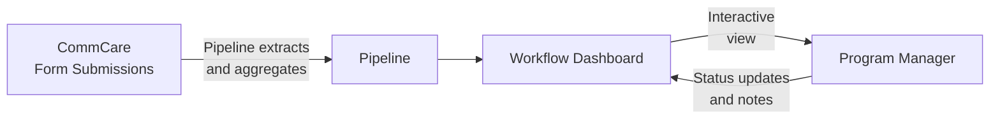

# Workflow Engine

The Workflow Engine lets program managers view configurable dashboards that pull live data directly from CommCare. Each workflow displays field worker performance metrics and supports drill-down into individual records, status tracking, and filtering.

---

## How Data Flows



**Pipelines** define what data to pull from CommCare and how to aggregate it — counts, sums, most recent values, percentages, and more. **Workflows** define what to display and how users interact with it.

---

## Finding Your Workflows

Click **Workflows** in the top navigation. You'll see a list of all workflows configured for your program.

Each row shows:

- Workflow name and type
- Last run time and data freshness
- Current status
- A schedule badge (for example, **⏱ Weekly**) if the workflow is running on an automatic schedule

Click any workflow to open its dashboard.

### Deep-linking to a specific workflow card

If someone shares a direct link to a specific workflow card — for example, a URL ending in `#workflow-5110` — the page will smoothly scroll to that card and briefly highlight it so you can spot it immediately, even on a long list. This works the same way in both the program view and the opportunity view.

### Program-level vs. opportunity-level workflows

Workflows in Labs are owned by either a **program** or a specific **opportunity**:

- **Program-owned workflows** are scoped directly to the program — they have no owning opportunity at all. They appear in the program view only, cover the program as a whole — for example, the Program Audit Creator and Program Audit Report — and do not appear under any individual opportunity. All operations on these workflows (opening them, creating a run, viewing a run page) work entirely within the program context; no opportunity is needed. When you open a program-owned workflow, it verifies your access at the program level and loads its pipeline data across all the opportunities the workflow spans — you do not need to select an individual opportunity first.
- **Opportunity-owned workflows** appear under their specific opportunity only. They will not appear in the program-level workflow list.

This means each workflow appears in exactly one place. If you cannot find a workflow you expect to see, check whether you are viewing the program level or the relevant opportunity level.

!!! note "The opp: badge is not shown in the program view"
    When you are browsing the program-level workflow list, opportunity identifiers are not displayed next to workflow names. Only workflows that are explicitly owned by the program appear there, so the badge carries no useful information at that level and is hidden to keep the list uncluttered.

!!! note "Creating a run from the program view"
    Clicking **Create Run** on a program-owned workflow works the same as creating a run from any other context. Because these workflows are genuinely scoped to the program rather than to any opportunity, Create Run resolves correctly from the program view with no extra steps required.

    If you have recently opened a per-opportunity run in another tab (for example, by clicking an "open run ↗" link"), that should no longer affect Create Run on program-owned workflows. The program view keeps the program context in place, so Create Run on a program-owned workflow will always create the run under the program — not under whichever opportunity you last visited. If you do see a "Workflow not found" error, try refreshing the program workflow list page and clicking Create Run again.

---

## Scheduling a Workflow to Run Automatically

Any workflow that supports a one-click default run can be put on a recurring schedule so it runs itself automatically — no one has to log in and click "run" each week.

### Setting up a schedule

On the workflow list screen, workflows that support scheduling show a **Schedule** button. Click it to configure:

- **Cadence** — choose from **Daily**, **Weekdays (Mon–Fri)**, **Weekly** (pick a day of the week), or **Monthly** (pick a day from 1–28)
- **Hour** — the time of day the workflow should run

Once saved, the workflow card shows a badge such as **⏱ Weekly** so you can see at a glance that it is scheduled. You can edit or remove the schedule from the same **Schedule** button at any time.

Scheduled runs use the same default run the workflow already supports, so nothing new needs to be configured on the workflow itself.

### Managing all schedules (Labs Admin)

A dedicated **Scheduled Workflows** page in **Labs Admin** lists every schedule across all users. For each entry you can see:

| Column | What it shows |
|---|---|
| Workflow | The workflow being scheduled |
| Owner | Who set the schedule up |
| Cadence | How often it runs |
| Next run | When it will run next |
| Last run status | Whether the most recent scheduled run succeeded |

From this page, administrators can **Disable** or **Delete** any schedule with a single click.

If a schedule can no longer run because the owner's login has expired, it shows **"Needs re-login"** and pauses itself automatically instead of failing silently. The owner will need to log back in, after which the schedule can be re-enabled.

---

## Opening a Workflow Run from a Link

If someone shares a direct link to a workflow run, the system will open it automatically — you do not need to select the opportunity from a context picker first. The run page reads the opportunity from the link and goes straight to the dashboard.

If a link was copy-pasted with extra text accidentally appended to it (for example, `?opportunity_id=1251 stacked bar chart`), the system will still recover the correct opportunity and clean up the address bar so everything works normally from that point on.

If the opportunity genuinely cannot be determined from the link, you will see a message explaining exactly what the system could not read, so it is clear the link itself is the problem rather than your access or context settings.

If the workflow belongs to an opportunity you are not a member of, you will see a message telling you exactly that — for example, *"This workflow belongs to opportunity 1251, which isn't one of your opportunities. Ask whoever shared it to give you access, then reopen the link."* This is different from a broken link: the link is valid, but you need to be added to that opportunity before you can open it. Contact whoever shared the link and ask them to give you access.

If the workflow cannot be loaded at all — for example, because your account has no opportunities listed or you are not a member of the organisation that owns the workflow — you will see a clear message such as: *"This workflow couldn't be loaded for opportunity 1251. You may not have access to that opportunity, or the workflow may have been removed. Ask whoever shared the link to confirm you have access to its opportunity."* If you see this, contact whoever shared the link and ask them to confirm your access. You will not see a raw technical error or an internal web address.

If you open a workflow run page without a specific run selected — for example, by following a partial link — you will be taken straight to the **workflow list** with that workflow's card highlighted. From there you can select an existing run or create a new one. There is no separate "pick a run" landing screen.

---

## Reading a Workflow Dashboard

A typical workflow dashboard shows a **table of field workers** with performance columns:

| Column type | What it shows                                |
| ----------- | -------------------------------------------- |
| Count       | Number of visits or activities in the period |
| Status      | Current enrollment or case status            |
| Last value  | Most recent recorded measurement             |
| Percentage  | Proportion of cases meeting a threshold      |

**Filtering and sorting:**

- Use the **date range picker** to focus on a specific period
- Click column headers to sort ascending or descending
- Use the **search box** to find a specific worker by name

**Drilling into a worker:**

Click any row to see that worker's detailed record — individual visit data, timeline of activities, and linked cases.

---

## Flags and Actions

### Flags column

Many per-opportunity reports include a **Flags** column. Flags are findings the system raises automatically based on the metrics — they represent concerns surfaced from the data, not judgments that a manager records manually.

When you open a report, the system reads the data and applies all relevant flags immediately on page load. There is nothing to click to trigger this — flags are already present by the time the dashboard is visible. A row with no concerns shows an em-dash (—).

Each active concern appears as a coloured pill in the Flags cell. The pill displays only the label text — there are no icons inside the pill. A row can carry more than one flag at the same time. Flag pills never break mid-phrase — the FLAGS column widens to fit the full label of whichever flags are active on that row.

**Flagged rows are lightly tinted** so that workers with active flags stand out in the table at a glance, rather than being visually indistinguishable from unflagged rows.

### Actions column

Every row has an **Actions** column. What the Actions cell shows depends on whether an audit or task has already been created for that worker in the current run, and whether the run is still in progress or has been saved as completed.

**When no audit or task exists yet**, the cell shows two menu buttons: **Create Audit ▾** and **Create Task ▾**.

The dropdown menus display each option as an outlined button so every option is clearly clickable. The open menu has a coloured border and header band matching its trigger button — blue for **Create Audit**, purple for **Create Task** — so the menu is visually connected to the button that opened it.

**Menu positioning:** When a row is near the bottom of the screen, the Create Audit and Create Task dropdown menus open upward instead of downward, so the options are always fully visible and never hidden below the edge of the screen.

**Create Audit menu** always contains exactly two options:

- **New Audit** — opens a blank audit record for that worker
- **Audit Last 7 days** — opens an audit pre-scoped to the most recent seven days of that worker's visits

**Create Task menu** contains:

- **New Task** — opens a blank task record for that worker
- **Coach on Flag implications** — only appears when the row carries at least one flag; opens a coaching task whose prompt is composed from the specific flag labels active on that row, so the coaching prompt stays relevant whether the FLW tripped SAM-low, MAM-low, gender-skew, or any combination of those flags

**When an audit or task has already been created**, the create menus are replaced by plain links:

- **View Audit** — appears in place of the Create Audit menu when an audit already exists for that worker in this run; clicking it opens that audit record directly
- **View Task** — appears in place of the Create Task menu when a task already exists for that worker in this run; clicking it opens that task record directly

**On a completed (saved) run**, rows that have no existing audit or task show greyed-out, non-interactive Create Audit and Create Task buttons. A saved run is a historical record — no new work can be started from it. Rows that already produced an audit or task still show working **View Audit / View Task** links so you can always navigate back to those records.

This means the Actions cell always reflects the current state of the row: rows with no prior action offer the create menus (on an in-progress run) or greyed-out buttons (on a completed run), and rows where action has already been taken show direct links to those records. This applies whether you are viewing the current week's run or replaying a historical run.

### CHC Nutrition Analysis flags

The CHC Nutrition Analysis dashboard uses the following flag catalog:

| Flag                            | What it means                                                                                                                     |
| ------------------------------- | --------------------------------------------------------------------------------------------------------------------------------- |
| **SAM rate < 1%**               | The FLW's SAM case rate is below 1% — a signal they may be visiting easier-to-reach households and missing the most at-risk cases |
| **MAM rate < 3%**               | The FLW's MAM case rate is below 3% — same pattern as the SAM flag but for moderate acute malnutrition                            |
| **Gender split outside 40–60%** | The gender split of the FLW's caseload falls outside the 40–60% range, in either direction                                        |

Percentage values in the CHC Nutrition table are formatted consistently throughout: one decimal place with the underlying counts shown in parentheses — for example, **92.0% (27/30)**. This applies to every percentage column in the table so figures are always directly comparable.

Worker names appear as full display names (for example, "Jumoke Balogun") everywhere in the CHC Nutrition table, in task and audit headers, and in the PAR drill-down — not as raw system usernames.

!!! note "SAM/MAM flags signal too few at-risk cases, not too many"
These flags trigger when an FLW's rate is **below** the expected threshold. A very low SAM or MAM rate suggests the worker is not reaching the households most likely to have malnourished children, not that their caseload is unusually healthy.

!!! note "Flags appear immediately when opening a new weekly run"
    When you open a brand-new CHC Nutrition weekly review, auto-detected flags (SAM rate < 1%, MAM rate < 3%, gender split) appear on each row the moment the table loads. You do not need to reload the page to see the system's findings — they are ready as soon as the dashboard is visible.

---

## Workflow Statuses

Many workflows include a status column that tracks where a case is in a program process:

```mermaid
stateDiagram-v2
    [*] --> Active
    Active --> "Review Needed": Flag raised
    "Review Needed" --> "Action Taken": Intervention done
    "Action Taken" --> Closed: Case resolved
    Active --> Closed: Graduated
```

Program managers can update a case's status directly from the workflow view. Status changes are stored in Labs and visible to all team members with access to the program.

---

## Program Audit Creator

The **CHC PRE-RCT — Program Audit Creator** workflow lets you generate audits across all opportunities in the program in a single step. When you open the Generate screen, you will see an audit window date range followed by a **Filters** section, and then the **Generate** button.

### Generate screen filters

The Filters section contains three optional controls. Leaving any filter empty includes everything — the behaviour is identical to how the workflow worked before these filters were added.

**Pass Threshold**

A slider ranging from 75% to 100% (default: 100%). This sets the minimum percentage of assessments that must pass for an audit to be marked "Pass" overall. Lowering the threshold means more audits will qualify as passing; keeping it at 100% requires every assessment to pass.

**Deliver Unit Type**

A set of checkboxes populated automatically from the visits recorded across the selected opportunities. Check one or more types to include only visits of those types in the generated audits. If no boxes are checked, all deliver unit types are included.

**Visit Type**

Checkboxes for the visit's payment status. The available options are:

| Option | What it includes |
|---|---|
| Pending | Visits awaiting approval |
| Approved | Visits that have been approved for payment |
| Rejected | Visits that have been rejected |
| Over Limit | Visits that exceed the payment cap |
| Duplicate | Visits flagged as duplicates |
| Trial | Trial or test visits |

Check one or more options to restrict the audits to visits with those statuses. If no boxes are checked, all visit types are included.

These three filters work together: only visits that match every checked filter are included when audits are generated. Using the same filter settings across a weekly run ensures all four opportunities are audited consistently with a single Generate click.

### Run list — audit window display

On the workflow run list page, each Program Audit Creator run shows its audit window (for example, **2026-06-22 – 2026-06-28**) beneath the run number, once a window has been set for that run. This makes it easy to identify which week a run covers without opening it.

---

## Bulk Image Audits

### Previously-audited image badges

When reviewing images in the bulk image audit grid, any photo that was already given a verdict in an earlier **completed** audit shows an **Audited** badge displaying that prior verdict — for example, **Audited: Passed**, **Audited: Failed**, or **Audited: Dup·Fake**. Hovering over the badge shows the date of the earlier audit.

This lets reviewers see at a glance that a decision already exists for a photo before assigning a new one. A photo never shows a badge from the audit currently being reviewed — the badge only ever reflects *other* completed audits.

### Excluding already-audited images from a new audit

When creating a new bulk image audit — either from a workflow or from the standalone audit wizard — an optional checkbox is available: **Exclude images already audited in a completed session.**

- **Left unchecked (the default):** all images in scope are included, exactly as before.
- **Checked:** any photo that already has a verdict from a completed audit is skipped. Only images that have never been audited are included in the new session.

The number of images skipped
